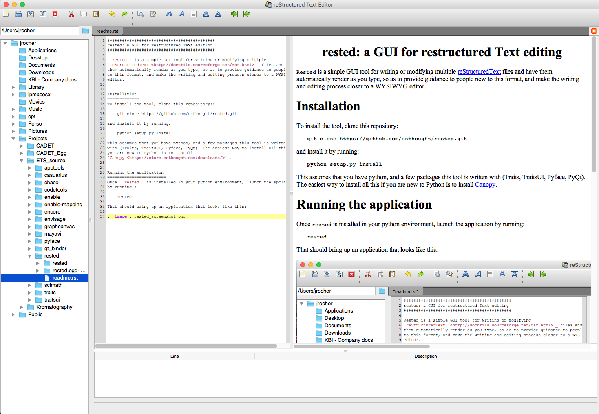

############################################
rested: a GUI for restructured Text editing
############################################

``Rested`` is a simple GUI tool for writing or modifying multiple
`reStructuredText <http://docutils.sourceforge.net/rst.html>`_ files and have
them automatically render as you type, so as to provide guidance to people new
to this format, and make the writing and editing process closer to a WYSIWYG
editor.

Installation
=============
To install the tool, clone this repository::

    git clone https://github.com/enthought/rested.git

and install it by running::

    python setup.py install

This assumes that you have python, and a few packages this tool is written
with (Traits, TraitsUI, Pyface, PyQt). The easiest way to install all this if
you are new to Python is to install
`Canopy <https://store.enthought.com/downloads/>`_.

Running the application
========================
Once ``rested`` is installed in your python environment, launch the application
by running::

    rested

That should bring up an application that looks like this:
    
